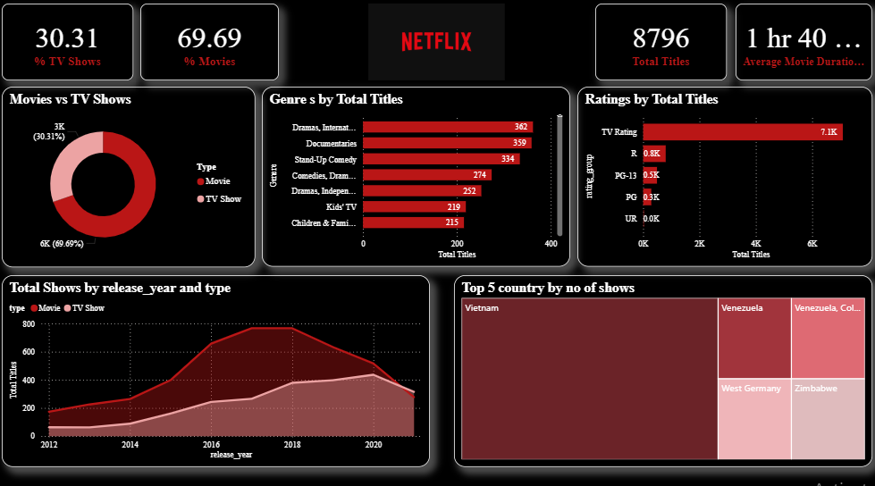

# 🎬 Netflix Movies & TV Shows Dashboard | Power BI

## 📌 Project Overview
This project analyzes **Netflix Movies and TV Shows data** to understand content distribution, genre trends, country-wise availability, ratings, and release patterns using **Power BI**.

The dashboard provides insights into how Netflix content varies by **type, genre, country, and year**, helping stakeholders understand content strategy.

---

## 🎯 Objectives
- Analyze **Movies vs TV Shows distribution**
- Identify **top genres on Netflix**
- Understand **content availability by country**
- Analyze **release year trends**
- Explore **ratings distribution**

---

## 🛠 Tools & Technologies
- Power BI  
- Excel / CSV Dataset  
- Data Cleaning & Transformation  
- DAX (Basic Measures)

---

## 📈 Key KPIs
- Total Titles  
- Movies Count  
- TV Shows Count  
- Top Genres  
- Content by Country  
- Titles by Release Year  
- Ratings Distribution  

---

## 📊 Dashboard Screenshots

### 🔹 Dashboard Overview

*(Screenshots are for quick preview. Full interactive dashboard is available in the `.pbix` file.)*

---

## 🔍 Key Insights
- Movies dominate the Netflix catalog compared to TV Shows  
- Drama and International genres are the most common  
- USA and India contribute a large portion of content  
- Significant growth in content addition after 2015  

---

## 📁 Project Files
- `Netflix.pbix` – Power BI dashboard file  
- `screenshots/` – Dashboard images  
- `README.md` – Project documentation  

---

## 🚀 How to Use
1. Download or clone this repository  
2. Open `Netflix.pbix` using **Power BI Desktop**  
3. Use filters and visuals to explore insights  

---

## 👩‍💻 Author
**Mamta Chavan**  
Aspiring Data Analyst | Power BI | SQL | Excel  

---

## ⭐ Feedback
If you find this project useful, feel free to ⭐ the repository!
